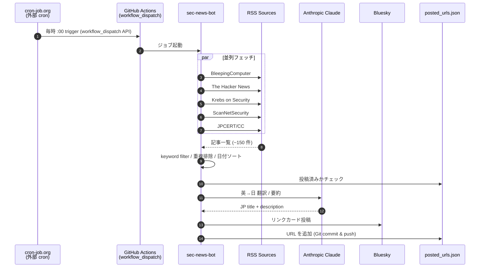

# sec-news-bot

[](https://github.com/httttmm/sec-news-bot/actions/workflows/post-articles.yml)

セキュリティ関連ニュースを国内外の RSS から集め、英語記事は Claude (Anthropic) で日本語に翻訳して Bluesky に投稿する Bot です。

外部 cron (cron-job.org) から GitHub Actions の `workflow_dispatch` をトリガーして、JST 9〜23 時の毎時 1 件ずつ投稿します。

---

## 投稿フォーマット

```
[日本語タイトル]

[2〜3 文の日本語要約 (100〜170 字)]

[#ハッシュタグ1 #ハッシュタグ2 #ハッシュタグ3]
```

リンクカード部分:

- 元記事の URL
- 日本語訳されたタイトルと説明
- 元記事の OGP 画像 (1MB 以内)

ハッシュタグは記事内容に応じて自動選定（最大 3 つ）。3 件未満の場合は `#情報セキュリティ` で補完されます。`src/modules/hashtagger.ts` の `HASHTAG_RULES` を編集してカスタマイズ可能。

---

## デフォルトのソース

| ソース | URL | 言語 | 内容 |
|---|---|---|---|
| BleepingComputer | bleepingcomputer.com | 英 | ランサムウェア・漏洩・侵害の報告ニュース |
| The Hacker News | thehackernews.com | 英 | CVE・サプライチェーン攻撃の解説 |
| Krebs on Security | krebsonsecurity.com | 英 | 業界権威・深掘り調査記事 |
| ScanNetSecurity | scan.netsecurity.ne.jp | 日 | 国内インシデント |
| JPCERT/CC | jpcert.or.jp | 日 | 国内 CERT 公式の警報・注意喚起 |

追加したいソースがあれば `SEC_FEED_URLS` をカンマ区切りで指定して上書きできます。

## 構成

```
sec-news-bot/
├── src/
│   ├── index.ts                  # オーケストレーター
│   ├── types/index.ts            # 型定義
│   └── modules/
│       ├── config.ts             # 環境変数読込
│       ├── logger.ts             # 構造化ログ
│       ├── dotenv.ts             # .env 読込
│       ├── rssFetcher.ts         # 複数 RSS を並列取得・マージ
│       ├── keywordFilter.ts      # セキュリティキーワード ホワイトリスト
│       ├── hashtagger.ts         # 記事内容に応じたハッシュタグ自動選定 (最大 3)
│       ├── languageDetect.ts     # CJK 比率による簡易言語判定
│       ├── translator.ts         # 言語別の翻訳/要約 (Claude Haiku)
│       ├── postedUrlsStore.ts    # 投稿済み URL の永続化
│       ├── ogpFetcher.ts         # OGP + 本文抽出
│       ├── safeHttp.ts           # SSRF 対策 + サイズ上限
│       └── blueskyPoster.ts      # Bluesky 投稿
├── tests/                        # vitest 単体テスト
├── scripts/
│   └── updateProfile.ts          # Bot bio を更新 (ワンショット)
├── data/posted_urls.json         # 投稿済み URL (Git 管理)
└── .github/workflows/
    └── post-articles.yml         # workflow_dispatch で起動 (外部 cron からトリガー)
```

## 必要環境

- Node.js 20 以上
- Bluesky アカウントとアプリパスワード
- Anthropic API キー

## システム構成



ホスティングは GitHub Actions の `ubuntu-latest` ランナー上で完結します。サーバー常設は不要で、トリガーされるたびに 1〜2 分立ち上がって終了するステートレス設計。状態は `posted_urls.json` として Git で永続化します。

## 技術スタック

### 言語・ランタイム

| 項目 | バージョン | 用途 |
|---|---|---|
| Node.js | 20+ | ランタイム |
| TypeScript | 5.5+ | 型安全な実装 |
| Vitest | 2.x | 単体テスト |
| tsx | 4.19+ | TypeScript の直接実行（dev/scripts 用） |

### 主要ライブラリ

| ライブラリ | 用途 |
|---|---|
| [`@atproto/api`](https://www.npmjs.com/package/@atproto/api) | Bluesky 公式 SDK（AT Protocol クライアント） |
| [`@anthropic-ai/sdk`](https://www.npmjs.com/package/@anthropic-ai/sdk) | Anthropic 公式 SDK（Claude Haiku 4.5 を呼び出して翻訳/要約） |
| [`rss-parser`](https://www.npmjs.com/package/rss-parser) | RSS / Atom フィードのパース |
| [`axios`](https://www.npmjs.com/package/axios) | HTTP クライアント（カスタム agent で SSRF 対策） |

外部依存は 4 つだけ。HTML パースは正規表現で自前実装（jsdom 等の重い依存を避けている）。

### インフラ

| レイヤ | 採用 | 理由 |
|---|---|---|
| 実行環境 | GitHub Actions | サーバー常設不要・Public リポジトリは無料無制限 |
| スケジューラ | GitHub Actions Cron | デプロイ環境と一体化、別途のスケジューラ不要 |
| 永続化 | `posted_urls.json` (Git 管理) | DB 不要。bot 自身が commit して push |
| LLM | Anthropic Claude Haiku 4.5 | 英→日翻訳のコストパフォーマンスが最良 |
| 公開先 | Bluesky (`@sec-news-bot.bsky.social`) | AT Protocol 経由でリンクカード投稿 |

## セットアップ (ローカル)

```bash
npm install
cp .env.example .env
# .env を編集して BLUESKY_HANDLE / BLUESKY_APP_PASSWORD / ANTHROPIC_API_KEY を記入

npm run setup:profile   # bio を更新 (初回のみ)
npm run dev              # 動作確認 (実投稿あり・Claude API 課金あり)
```

## 環境変数

| 変数名 | 必須 | デフォルト | 説明 |
|---|---|---|---|
| `BLUESKY_HANDLE` | ✅ | — | Bluesky ハンドル名 |
| `BLUESKY_APP_PASSWORD` | ✅ | — | Bluesky アプリパスワード |
| `ANTHROPIC_API_KEY` | ✅ | — | Anthropic API キー |
| `TRANSLATION_MODEL` | — | `claude-haiku-4-5-20251001` | 使用 Claude モデル |
| `SEC_FEED_URLS` | — | (デフォルト 5 ソース) | カンマ区切りで上書き可 |
| `MAX_POSTS_PER_RUN` | — | `1` | 1 実行あたり最大投稿件数 |
| `DISABLE_KEYWORD_FILTER` | — | `false` | `true` でキーワードフィルタを無効化 |
| `POSTED_URLS_FILE` | — | `data/posted_urls.json` | 投稿済み URL 保存先 |
| `MAX_STORED_URLS` | — | `1000` | 投稿済み URL の保持上限 (超えると古いものからバッチ削除) |
| `POST_INTERVAL_MS` | — | `3000` | 投稿間隔 (ms) |
| `BOT_DESCRIPTION` | — | (出典明示文) | `npm run setup:profile` で bio に設定 |
| `DEBUG` | — | — | `true` でデバッグログ |

## キーワードフィルタ

`src/modules/keywordFilter.ts` の `SECURITY_KEYWORDS` で定義。デフォルトでは以下をカバー:

- CVE / 脆弱性 / ゼロデイ
- ランサムウェア / 恐喝
- 漏洩 / 侵入 / 不正アクセス / 改ざん / 踏み台 / 個人情報
- サプライチェーン攻撃 / 悪意のあるパッケージ
- マルウェア / フィッシング
- DDoS / ボットネット
- 標的型攻撃 / APT / ハッカー / なりすまし / サイバー犯罪
- 各種攻撃手法 (RCE, XSS, SQL injection 等)

雑音が多い / 拾いたいキーワードがある場合はリストを直接編集してください。

`DISABLE_KEYWORD_FILTER=true` で一時的にフィルタを切れます (デバッグ用)。

## テスト

```bash
npm test
npm run typecheck
```

外部依存 (HTTP / RSS / Bluesky / Anthropic SDK) はインターフェース注入で差し替え可能にしてあり、すべてユニットテストでカバーできます。

## GitHub Actions の設定

1. Settings → Secrets and variables → Actions で登録:
   - `BLUESKY_HANDLE`
   - `BLUESKY_APP_PASSWORD`
   - `ANTHROPIC_API_KEY`
2. Settings → Actions → General → Workflow permissions で *Read and write permissions* を有効化
3. Actions タブから `Post security news to Bluesky` を `workflow_dispatch` で手動実行して動作確認

## 設計メモ（補足）

- 重複排除のキー: URL（フラグメントと `utm_*` クエリを除去して正規化）
- 言語判定の閾値: CJK 文字の比率が 15% 以上で日本語と判定
- 翻訳失敗時: 記事をスキップ → posted_urls に登録しない → 次の run で再挑戦
- `posted_urls.json` の上限: デフォルト 1000 件（`MAX_STORED_URLS` で変更可）。超過時はバッチで 10% 削減（例: 1000 → 900 件）
- `[skip ci]`: bot 自身の commit メッセージに付与して、自分の commit がワークフローを再トリガーしないようにしている

---

## 工夫した点

### コスト・運用
- インフラコスト 0 円運用（GitHub Actions + Bluesky 無料 + Claude Haiku 月 $0.05 程度）
- GitHub Actions の schedule cron は遅延/スキップしやすいため、外部 cron (cron-job.org) から `workflow_dispatch` API でトリガーして信頼性を確保。多重実行は `concurrency` で抑制

### 永続化・重複排除
- 投稿済み URL を Git で永続化することで DB を立てずに重複投稿防止
- URL を `utm_*` クエリやフラグメント除去で正規化してから比較
- `posted_urls.json` の上限到達時はバッチ削減（1000 → 900）で書き込み頻度を抑制

### 堅牢性・エラー耐性
- SSRF 対策として `dns.lookup` を hook、プライベート IP・loopback・link-local への接続を拒否
- DoS 対策として axios の `maxContentLength` で HTML 2MB / 画像 1MB に制限
- マルチソース RSS を `Promise.allSettled` で並列取得し、1 ソース落ちても全体は継続
- 翻訳失敗時は英語のまま投稿せず、posted_urls に登録もしないので次の run で API 復帰後に再挑戦

### テキスト処理・コンテンツ生成
- 国内ニュースサイトの Shift_JIS / EUC-JP を自動判定して TextDecoder でデコード
- Bluesky の 300 グラフェム制限内で title / 要約 / ハッシュタグの予算を動的配分
- 記事内容にマッチしたハッシュタグを優先度順に最大 3 つ動的選定

### テスタビリティ
- 外部依存をインターフェース注入で差し替え可能にし、実 API を叩かずユニットテスト完結
