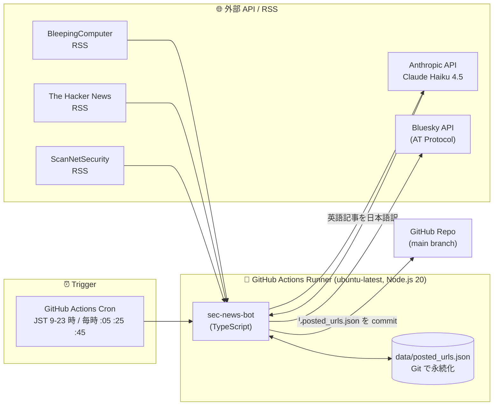

# sec-news-bot

[](https://github.com/httttmm/sec-news-bot/actions/workflows/post-articles.yml)

セキュリティ関連ニュースを国内外の RSS から集め、英語記事は Claude (Anthropic) で **日本語に翻訳** して Bluesky に投稿する Bot です。

GitHub Actions の cron で JST 9〜23 時の毎時 1 件ずつ投稿します。

---

## システム構成図



**ホスティング**: すべて GitHub Actions の `ubuntu-latest` ランナー上で実行。サーバー常設は不要で、cron 実行のたびに 1〜2 分立ち上がって終了する **ステートレス設計**。状態は `posted_urls.json` として Git で永続化する。

---

## 技術スタック

### 言語・ランタイム

| 項目 | バージョン | 用途 |
|---|---|---|
| **Node.js** | 20+ | ランタイム |
| **TypeScript** | 5.5+ | 型安全な実装 |
| **Vitest** | 2.x | 単体テスト |
| **tsx** | 4.19+ | TypeScript の直接実行（dev/scripts 用） |

### 主要ライブラリ

| ライブラリ | 用途 |
|---|---|
| [`@atproto/api`](https://www.npmjs.com/package/@atproto/api) | Bluesky 公式 SDK（AT Protocol クライアント） |
| [`@anthropic-ai/sdk`](https://www.npmjs.com/package/@anthropic-ai/sdk) | Anthropic 公式 SDK（Claude Haiku 4.5 を呼び出して翻訳/要約） |
| [`rss-parser`](https://www.npmjs.com/package/rss-parser) | RSS / Atom フィードのパース |
| [`axios`](https://www.npmjs.com/package/axios) | HTTP クライアント（カスタム agent で SSRF 対策） |

外部依存は **最小限の 4 つだけ**。HTML パースは正規表現で自前実装（jsdom 等の重い依存を避ける）。

### インフラ

| レイヤ | 採用 | 理由 |
|---|---|---|
| 実行環境 | **GitHub Actions** | サーバー常設不要・Public リポジトリは無料無制限 |
| スケジューラ | GitHub Actions Cron | デプロイ環境と一体化、別途のスケジューラ不要 |
| 永続化 | **`posted_urls.json` (Git 管理)** | DB 不要。bot 自身が commit して push |
| LLM | Anthropic Claude Haiku 4.5 | 英→日翻訳のコストパフォーマンスが最良 |
| 公開先 | Bluesky (`@sec-news-bot.bsky.social`) | AT Protocol 経由でリンクカード投稿 |

---

## 工夫した点

### 💰 インフラコスト 0 円運用

| 項目 | コスト |
|---|---|
| GitHub Actions（Public repo） | **無料・無制限** |
| Bluesky API | **無料** |
| Anthropic API（Haiku 4.5）| **約 $0.05 / 月**（15 件 × 30 日、月 450 リクエスト） |
| ストレージ（DB / KV）| **不要**（Git で十分） |

合計 **月 8 円程度**。サーバーを 1 台借りるよりも遥かに安く、しかも「24h 起動しっぱなし」のような無駄が無い設計。

### 🛡️ 二重投稿防止（永続化キャッシュ機構）

- 投稿済み URL を `data/posted_urls.json` に保存し、Git 経由で永続化
- bot 自身が commit & push するため、**DB を立てなくても再起動を跨いで状態が残る**
- 上限を超えたらバッチ削減（1000 → 900）。1 件ずつ削除よりも書き込み回数が少なく効率的
- URL は **`utm_*` トラッキングクエリやフラグメント (`#`) を除去して正規化** してから比較するため、同じ記事が違う URL で再投稿されることを防止

### 🔒 SSRF / DoS 対策（OGP 取得時のセキュリティ）

OGP 取得は外部 RSS から渡された任意の URL を fetch するため、放置すると **内部メタデータエンドポイント (例: `http://169.254.169.254/`) や localhost に飛ばされる SSRF リスク** がある。これを `src/modules/safeHttp.ts` で対策:

- `http(s):` 以外のスキーム拒否
- **`dns.lookup` を hook** して解決後の IP がプライベート範囲 (10/8, 127/8, 172.16/12, 192.168/16, 169.254/16, IPv6 ULA / link-local) なら接続自体を拒否
- リダイレクト先も同じ hook を通るので、リダイレクト経由の SSRF も塞げる
- `maxContentLength` / `maxBodyLength` で **HTML 2MB / 画像 1MB** に制限（巨大レスポンスでメモリ枯渇を防ぐ）

### 🌏 文字コード自動判定（Shift_JIS / EUC-JP / UTF-8）

国内のニュースサイト（ITmedia / Impress 系など）は依然として **Shift_JIS で配信されている** ところがあり、axios のデフォルトの UTF-8 解釈では文字化けする。`src/modules/ogpFetcher.ts` で:

- レスポンスを `arraybuffer` で受け取り、自前でデコード
- `Content-Type` ヘッダの charset を最優先
- 無ければ HTML の `<meta charset>` / `<meta http-equiv>` を見て判定
- Node 標準の `TextDecoder` で `shift_jis` / `euc-jp` / `iso-2022-jp` / `utf-8` を切り替え

### 📝 投稿フォーマット最適化（Bluesky の 300 グラフェム制限内に動的配分）

Bluesky は本文 300 グラフェム制限。`Intl.Segmenter` でグラフェム単位で正確にカウントし、

1. ハッシュタグ行の予算を先に確保（末尾固定）
2. 残りからタイトルに最大 90 グラフェム
3. その残りを要約に割り当て、不足時は省略

の順で **動的にレイアウト** している。タイトルが極端に長い場合は `…` で切り詰め。

### 🔄 翻訳失敗時のグレースフル降格

- Anthropic API が `529 Overloaded` を返した時 → **SDK の自動リトライを 8 回 (指数バックオフで ~60 秒)**
- それでも失敗した場合 → **記事をスキップ、`posted_urls.json` に登録しない**
- → **次の run で API 復帰後に再挑戦** される

「英語のまま投稿する」というアンチパターンを避け、確実に日本語化された投稿のみが流れる設計。

### 📡 マルチソース並列取得 & フェイルセーフ

- 3 つの RSS を **`Promise.allSettled`** で並列取得
- 1 つのソースが落ちても他のソースは続行
- 全ソースを 1 本にマージして **publish 日時の新しい順** にソート → 自然なソース多様化

### 🤖 文脈認識ハッシュタグ自動付与

`src/modules/hashtagger.ts` で、優先度順の正規表現ルールに従って **記事内容にマッチしたハッシュタグを最大 3 つ自動付与**。「同じタグを毎回つける」のではなく、ランサムウェアの記事には `#ランサムウェア`、CVE 記事には `#CVE #脆弱性` のように **動的に変わる** ので投稿の質感がぶれない。

### ⏰ Cron 不発対策

GitHub Actions の cron は高負荷時に遅延・スキップする仕様。これを緩和するため、毎時 **`:05` / `:25` / `:45` の 3 タイミング** で起動 + `concurrency` 制御で多重実行を防止。結果として「平常時は毎時 1 件、GitHub が混雑した時間帯は次の枠で追いつく」挙動になる。

### 🧪 単体テスト（113 ケース）

外部 API は **インターフェース注入で差し替え可能** な設計にして、すべての主要モジュールに単体テストを用意:

| モジュール | テスト件数 | 主な内容 |
|---|---|---|
| `config` | 13 | env 変数のパース・バリデーション |
| `rssFetcher` | 6 | マルチソース合流・並べ替え・1 ソース落ち時の挙動 |
| `keywordFilter` | 7 | 英日キーワード照合 |
| `hashtagger` | 11 | 優先度・上限・フォールバック・誤検知防止 |
| `languageDetect` | 5 | CJK 比率による日英判定 |
| `translator` | 5 | Anthropic SDK モック・JSON パース |
| `blueskyPoster` | 9 | 投稿テキスト構築・グラフェム切り詰め |
| `postedUrlsStore` | 8 | 永続化・上限ローテーション・既存ファイル対応 |
| `ogpFetcher` | 23 | OGP 抽出・charset 検出・本文抽出 |
| `safeHttp` | 26 | プライベート IP 判定・URL 検証 |

---

## 投稿フォーマット

```
[日本語タイトル]

[2〜3 文の日本語要約 (100〜170 字)]

[#ハッシュタグ1 #ハッシュタグ2 #ハッシュタグ3]
```

リンクカード部分:
- 元記事の URL
- 日本語訳されたタイトルと説明
- 元記事の OGP 画像 (1MB 以内)

ハッシュタグは記事内容に応じて自動選定（最大 3 つ）。`src/modules/hashtagger.ts` の `HASHTAG_RULES` を編集してカスタマイズ可能。

---

## デフォルトのソース

| ソース | URL | 言語 | 内容 |
|---|---|---|---|
| **BleepingComputer** | bleepingcomputer.com | 英 | ランサムウェア・漏洩・侵害の報告ニュース |
| **The Hacker News** | thehackernews.com | 英 | CVE・サプライチェーン攻撃の解説 |
| **ScanNetSecurity** | scan.netsecurity.ne.jp | 日 | 国内インシデント |

追加したいソースがあれば `SEC_FEED_URLS` をカンマ区切りで指定して上書きできます。

## 構成

```
sec-news-bot/
├── src/
│   ├── index.ts                  # オーケストレーター
│   ├── types/index.ts            # 型定義
│   └── modules/
│       ├── config.ts             # 環境変数読込
│       ├── logger.ts             # 構造化ログ
│       ├── dotenv.ts             # .env 読込
│       ├── rssFetcher.ts         # 複数 RSS を並列取得・マージ
│       ├── keywordFilter.ts      # セキュリティキーワード ホワイトリスト
│       ├── hashtagger.ts         # 記事内容に応じたハッシュタグ自動選定 (最大 3)
│       ├── languageDetect.ts     # CJK 比率による簡易言語判定
│       ├── translator.ts         # 言語別の翻訳/要約 (Claude Haiku)
│       ├── postedUrlsStore.ts    # 投稿済み URL の永続化
│       ├── ogpFetcher.ts         # OGP + 本文抽出
│       ├── safeHttp.ts           # SSRF 対策 + サイズ上限
│       └── blueskyPoster.ts      # Bluesky 投稿
├── tests/                        # vitest 単体テスト
├── scripts/
│   └── updateProfile.ts          # Bot bio を更新 (ワンショット)
├── data/posted_urls.json         # 投稿済み URL (Git 管理)
└── .github/workflows/
    └── post-articles.yml         # JST 9〜23時に毎時実行
```

## 必要環境

- Node.js 20 以上
- Bluesky アカウントとアプリパスワード
- Anthropic API キー

## セットアップ (ローカル)

```bash
npm install
cp .env.example .env
# .env を編集して BLUESKY_HANDLE / BLUESKY_APP_PASSWORD / ANTHROPIC_API_KEY を記入

npm run setup:profile   # bio を更新 (初回のみ)
npm run dev              # 動作確認 (実投稿あり・Claude API 課金あり)
```

## 環境変数

| 変数名 | 必須 | デフォルト | 説明 |
|---|---|---|---|
| `BLUESKY_HANDLE` | ✅ | — | Bluesky ハンドル名 |
| `BLUESKY_APP_PASSWORD` | ✅ | — | Bluesky アプリパスワード |
| `ANTHROPIC_API_KEY` | ✅ | — | Anthropic API キー |
| `TRANSLATION_MODEL` | — | `claude-haiku-4-5-20251001` | 使用 Claude モデル |
| `SEC_FEED_URLS` | — | (デフォルト 3 ソース) | カンマ区切りで上書き可 |
| `MAX_POSTS_PER_RUN` | — | `1` | 1 実行あたり最大投稿件数 |
| `DISABLE_KEYWORD_FILTER` | — | `false` | `true` でキーワードフィルタを無効化 |
| `POSTED_URLS_FILE` | — | `data/posted_urls.json` | 投稿済み URL 保存先 |
| `MAX_STORED_URLS` | — | `1000` | 投稿済み URL の保持上限 (超えると古いものからバッチ削除) |
| `POST_INTERVAL_MS` | — | `3000` | 投稿間隔 (ms) |
| `BOT_DESCRIPTION` | — | (出典明示文) | `npm run setup:profile` で bio に設定 |
| `DEBUG` | — | — | `true` でデバッグログ |

## キーワードフィルタ

`src/modules/keywordFilter.ts` の `SECURITY_KEYWORDS` で定義。デフォルトでは以下をカバー:

- CVE / 脆弱性 / ゼロデイ
- ランサムウェア / 恐喝
- 漏洩 / 侵入 / 不正アクセス
- サプライチェーン攻撃 / 悪意のあるパッケージ
- マルウェア / フィッシング
- 各種攻撃手法 (RCE, XSS, SQL injection 等)

雑音が多い / 拾いたいキーワードがある場合はリストを直接編集してください。

`DISABLE_KEYWORD_FILTER=true` で一時的にフィルタを切れます (デバッグ用)。

## テスト

```bash
npm test
npm run typecheck
```

## GitHub Actions の設定

1. **Settings → Secrets and variables → Actions** で登録:
   - `BLUESKY_HANDLE`
   - `BLUESKY_APP_PASSWORD`
   - `ANTHROPIC_API_KEY`
2. **Settings → Actions → General → Workflow permissions** で *Read and write permissions* を有効化
3. **Actions** タブから `Post security news to Bluesky` を `workflow_dispatch` で手動実行して動作確認

## 設計メモ（補足）

- **重複排除のキー**: URL（フラグメントと `utm_*` クエリを除去して正規化）
- **言語判定の閾値**: CJK 文字の比率が **15% 以上** で日本語と判定
- **翻訳失敗時**: 記事をスキップ → posted_urls に登録しない → 次の run で再挑戦
- **`posted_urls.json` の上限**: デフォルト 1000 件（`MAX_STORED_URLS` で変更可）。超過時はバッチで 10% 削減（例: 1000 → 900 件）
- **`[skip ci]`**: bot 自身の commit メッセージに付与して、自分の commit がワークフローを再トリガーしないようにしている
